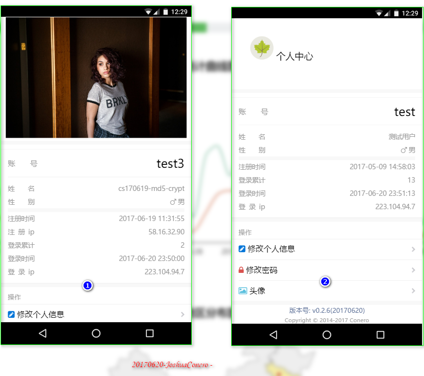
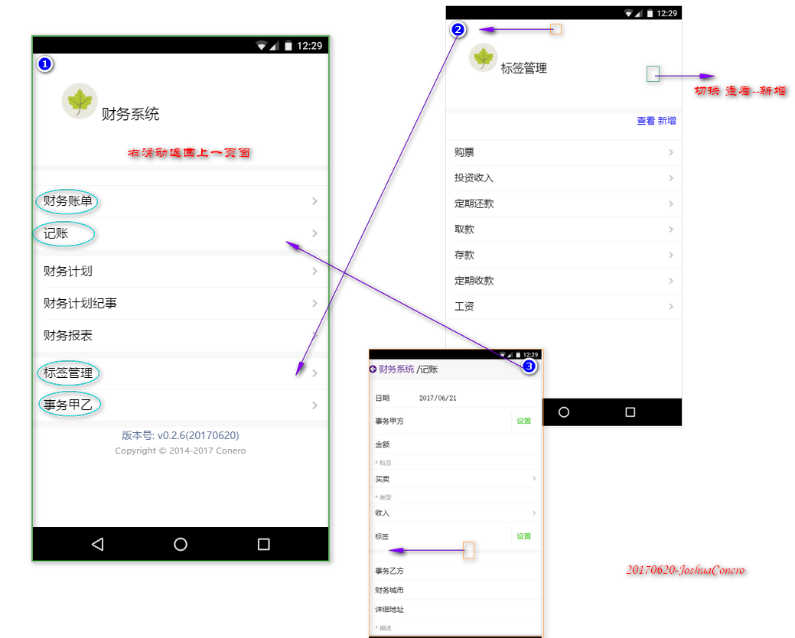

# 更改版本记录
## V 0.2.7 2017年6月21日 星期三
- [移动版建设]
    - 财务系统
        - 首页新增“科目管理”导航
        - 科目管理： 模块新增，基本与“事务标签”一样
        - 记账(财务账单)： 
            - 新增后台API支持数据采集
            - 科目自动从数据库动态获取
            - 从数据库提取数据
- [其他]
    - 科目管理： 数据库设置
    - hyang/Bootstrap::SelectGrid 回调函数传递bug修复
    - 新增“财务账单”模型
    - 后台API新增

## V 0.2.6 2017年6月20日 星期二
- [移动版建设]
    - 个人中心图像提取(界面优化) 
        - 测试用户：
            1. 用户: test, 密码: 123456
            2. 用户: test2, 密码: 123456
            3. 用户: test3, 密码: 123456
        - 截图如下：
            - 
    - 财务系统/子界面
        - 支持右滑动返回主界面
        - 标签管理： 左滑动 edit/home 切换
        - 

## V 0.2.5 2017年6月19日 星期一
- [移动版建设]
    - 密码认证更新，将MD5切换为crypt
    - 个人中心/头像： 
        后台数据上传支持(api/user/portrait)
        实现本地图片上传预览，以及异步文件(测试图像成功)上传

- [其他]
    - 新增用户表字段：盐值
    - app\common\SysFile 文件上传优化

## V 0.2.4 2017年6月18日 星期日
- [移动版建设]
    - 首页： 修复的登录失效时，user页面不再展示(前端通过登录标识判断)
    - 个人中心
        - 丰富首页展示内容，以及展示已经存在的数据项（非必填项）
        - (新增) 密码更新功能; 头像上传界面        
    - 用户注册
        - 后台程序优化，用 FeekMsg 替换数据库返回； 以及界面优化
    - 财务管理/记账： 事务甲方 picker 数据提取
    - 其他
        - 新增绑定邮箱/手机号可作为账户名别名登陆系统，以及注册时程序支持   
        - 后台相关API更新     

## V 0.2.3 2017年6月17日 星期六
- [移动版建设]
    - (新增) 财务系统/标签管理： 
        新增模块，实现后台数据采集，主要是数据写入。
        开始设计为home/edit两个页面，后将两者合并到同一页面
        引入zepto.js/touch 模块用于实现tab页面滑动切换
    - (优化) 财务系统/财务甲乙：
        表单优化，分组码支持 picker 控件可选
        数据列表添加图标
    - (优化) 首页/关于： 内容新增
- [其他]    
    - hyang/Boostrap 新增 radio 生成器，用于php后台数据
    - api/finance 模块新增： 实现 ftag 后台数据 维护支持
    - aurora.js formJson 方法bug修复: 修复 zepto.js 无法使用jquery风格获取选中值(提供原生可选)
- [计划项]        
> (#PCA-170517001-S) 首页新增 touch tab 样式切换

## V 0.2.2 2017年6月15日 星期四
- [移动版建设]
    - 财务系统/财务甲乙： 
        home 实现后台数据提取        
        edit 实现后台数据采集
    - 登录/注册模块-UI 优化
- 其他
    - 新增/财务甲乙-数据调用API
    - 新增/财务甲乙-数据模型

## V 0.2.1 2017年6月13日 星期二
- [移动版建设/财务系统]
    - 后台数据库设置： 新增财务登账/支持明细，财务计划/纪事支持，财务报表/支持操作日志记录，财务便签，财务甲乙方
    - 财务账单： 
            数据编辑页面数据项更新，表单与数据库对应
            新增edit.js 用户检测表单
    - 财务系统
            页面更新，中心设计部分功能项
    - 财务甲乙
            模块新增，设计index/edit 主页和基本表单页面
            新增edit.js 用户检测表单

## V 0.2.0 2017年6月11日 星期日
- [移动版建设]
    - 财务系统： 设计， 如数据库，以及功能等
    - 登录系统： 优化，修改成功后的调整地址，直接跳到个人中心(原为wap主页)；输入字符自动删除空格(人性化处理)

## V 0.1.23 2017年6月10日 星期六
- [移动版建设] 
    - 首页
        优化界面显示，跳转“涂鸦”模块进入模块是才自动加载数据/自动判断处理
        个人中心界面优化
    - 个人中心模块新增
        完成基本的数据展示(模块首页以及基本信息提取)
        新增用户编辑页面，布局维护表单
    - 财务系统/finance 模块新增： 首页实验性布局
    - 财务账单/faccount 模块新增：首页/记账实验性布局
- [API]
    - 系统登录程序优化： 
        如登录时保存更加全面的信息
        新增用户登出接口
        开发者token登录时跳转优化
    - 注册页面优化，新增注册ip字段
- [数据库]
    - 用户信息表： 
        删除最近登录时间/ip 从登录记录表中提取
        其他字段完善
- [其他]
    - common\Aurora 新增 visitSession 相关操作
    - User/用户模型提供 用户完整信息获取方法 getUserInfo
    - aurota.js 新增 Validate  验证器
    - aurora.wap.js 新增 Wap.WeuiFromCheck / 表单检测

## V 0.1.22 2017年6月8日 星期四
- [移动版建设] 
    - 文章界面优化
        - 新增数据加载按钮(分页机制实现)，以及友好性提示
        - 数据通过“作者/文集”等筛选
    - 涂鸦UI设计
        - 通过 weui-flex 设计列表组件
        - 文本全选/复原切换，数据提取优化
    - wap.css 过度方式设计： aurora-border

## V 0.1.21 2017年6月6日 星期二
- [移动版建设] 
    - 首页新增“涂鸦”模块，首页样式优化
    - 新增“涂鸦”页面，以及实现数据采集
    - 注册/登录界面优化
- 其他
    - 数据库： 新增“涂鸦”后台支持
    - 模型： 涂鸦模型处理
    - api： 涂鸦后台API程序开发

## V 0.1.20 2017年6月5日 星期一
- [移动版建设]
    - 通知公共模块新增
        - 新增模块主页以及阅读页面
    - 文章/通知 模块引入JiaThis插件用于分享机制
    - 文章数据提取从原来的 Db 迁移到模型提取(包括桌面版程序)
    - 文章/编辑模块优化 - 自动从历史数据中提取文集/署名，提供参照项
    - 首页 通知公告数据提取显示
- [模型]    
    - 新增文章/Atc1000c，评论/Atc1002c 模型
    - Atc1002c 集成 信息公告-getInfos 方法
- [其他]
    - 引入[JiaThis](http://www.jiathis.com/)分享插件 

## V 0.1.19 2017年6月4日 星期日
- [桌面版建设/系统管理]
    - 系统项目管理 - 优化
        - 项目配置项，存在一个系统自动生成的 sys_auto 分组码 => {},用于形成项目相关的系统自动设置
        - “信息发布”优化，数据提取，新增后台数据维护页面。
        - 详情页面/about 通过描点自动更新tab页面
- 模型
    - 项目系统/Prj1001c 模型优化        

## V 0.1.18 2017年6月3日 星期六
- [桌面版建设/系统管理]
    - 系统分组模块 - 实现
        - 实现基本的页面布局，以及支持数据采集
        - 编辑页面布局，save数据保存实现
    - 系统项目管理 - 优化
        - 项目主界面更新
        - 新增项目下的子页面“信息发布”模块，以及后台数据库新增
    - aurora.web.js
        - 新增 tinymce 功能方法，用于实现富文本
- [api]
    - 微信端接入聚合数据Api中的图灵机器人
    - 微信端服务器测试
- 其他
    - 数据库
        - 设计系统项目管理的-信息发布模块设计
        - 项目分组数据表结构优化
    - 引入[tinymce](https://www.tinymce.com/)富文本编辑器

## V 0.1.17 2017年6月1日 星期四
- Web/Wap 添加微信公众后入口
- [api]
    - 新增微信后台处理程序，调整上一版本程序微信处理程序。类化，便于本地测试
    - 微信自动回复功能测试，以及通过后台配置数据获取关注时触发文本，以及命令文档
- [桌面版建设/系统管理]
    - 模块新增： 系统分组
        - 引入 GoJs1.7.11 可视化脚本
        - 分别是 GoJs/Jstree 做首页可视化展示(前者参照模板-kanban，比较复杂)
- Model
    - 新增 Group/Role 分组数据模型        
    - Group 分别新增 GoJs/jstree 后台数据结构生成方法

## V 0.1.16 2017年5月31日 星期三
- [api]
    - 新增微信请求记录日志
    - 新增自动回复功能，实现 文章搜索功能
- 系统管理日志页面布局优化 - (优化)

## V 0.1.15 2017年5月30日 星期二
- [桌面版建设]
    - 门户页面
        - 文章
            - 文章模块以及首页布局优化，展示内容更加详细
            - 新增文章评论以及文章star
            - 文章列表数据优化，以及可根据作者或文集筛选以及换行
        - 捐赠
            - 完善社区捐赠，包括Wap端
- [API]
    - 文章后台数据处理，如新增后台评论数据维护，文章star 功能
- 数据库： 文章后台数据表字段完善

## V 0.1.14 2017年5月29日 星期一
- [桌面版建设]
    - 门户页面
        - 新增 文章(essay)模块，用于暂时记载来自手机端加载的文章； 新增主显示也以及阅读页。基本上算重新了移动端的文章模块
        - 首页布局更新： 新增文章列表用于调整至文章页面        
    - 系统管理
        - 项目管理程序以后，做数据重复性检测
- [移动版建设]
    - 主页描述文本从数据库中读取
- 其他
    - Prj1001c 模块更新，新增快速配置数据获取函数，包括单个和多个
    - hyang/Bootstrap 搜索框优化
    - 项目管理后台api更新
    
## V 0.1.13 2017年5月28日 星期日
- [桌面版建设]
    - 系统管理
        - 模块统一图标等统一充数据库获取，方便以后动态修改等(自从设计项目管理以后)。
        - 项目管理模块： 项目详情页面，新增项目配置项的数据采集功能
- API
    - 应用接口程序 FeekMsg 方法新增数据返回，方法优化
- aurora.js
    - 引入 Doeeking V2 的 getUrlBind  方法，用于获取url中的值
    - 引入Doeeking V2中的popup窗以及做对应的程序调整
    - aurora.web.js     formGroup 方法优化，支持textarea，以及其他优化

## V 0.1.12 2017年5月25日 星期四
- [桌面版建设]
    - 系统管理
        - 项目管理/项目主页 布局设计
    - aurora.web.js 
        - 新增 formGroup 方法： 表单格式化数据生成器
        - 新增 ModalAlert 方法： 模态是表单数据内嵌式文本提示框
        
## V 0.1.11 2017年5月24日 星期三
- [系统]
    - 实现文件上传公共方法，包括文件上传以及同组文件新增，删除等
    - 系统文件数据库相关更变，即字段新增和完善
    - 数据库新增键数据表
- [桌面版建设]
    - 系统管理
        - 新增模块/项目管理
            - 模块搭建，以及基本数据展示
            - 新建首页，编辑和数据维护，和关于项目等页面
            - 可能通过该模块实现数据配置项： 以及扩展其他项目用于处理和记录项目相关内容(计划项)
        - 将原来的页面的数据项，转移到后台数据获取

## V 0.1.10  2017年5月23日 星期二
- [移动版建设]
    - 文章模块实现： 代码优化，微调
- [桌面版建设]
    - 系统管理
        - 新增模块：系统APIs数据显示页面，布局以及基本数据展示
        - 系统访问记录模块微调优化
- [其他]
    - 编辑 Oschina相关处理接口，基本实现普通接口调用
    - 引入 [ApacheMimeTypes](https://github.com/dflydev/dflydev-apache-mime-types) 库用于处理是来自 Doeeking V2中的url保存图片功能
    - 数据库新增-项目相关的数据库表设计(探索)
    - 以及数据库其他优化

## V 0.1.9  2017年5月22日 星期一
- [移动版建设]
    - 文章模块实现
        - article 模块新增
        - 首页/阅读/我的文章等页面新
        - 后台数据库数据采集实现
    - 头文件引入 Font-Awesome 图标
- [Api]        
    - 新增文章后台数据维护接口
- 其他
    - aurora.js 新 ResetFrom 手动重置表单函数

## V 0.1.8  2017年5月21日 星期日
- [桌面版建设]
    - aurora.web.js 
        - formListGrid 表单监听器新增 afterAddRow 接口
        - 封装删除数据自动提交 indexDelLink
        - 新增 Think 类，用于与 thinkphp 配合，比如地址，模块以及控制器解析等处理
    - 系统管理
        - 系统日志，系统菜单，数据回收，系统报告，系统主键生成器，系统令牌等程序功能完善，实现基本的数据采集处理
        - 系统菜单新增图标，支持 font awesome或普通 img
- 其他
    - hyang/Bootstrap     程序优化
    - 系统菜单新增图标，调整数据库
## V 0.1.7  2017年5月20日 星期六
- [桌面版建设]
    - 系统管理
        - 系统常量功能模块完善： 支持数据的基本采集
        - 系统日志模块功能实现： 实现远程日志操作，如删除查看日志等；以及完成自定义系统日志
        - 系统菜单程序优化
    - 引入 Doeeking V2 中写好的bootstrap插件，并且调整适应 Boostrap V4
    - aurora.web.js 方法优化
    - 桌面版风格慢慢形成风格化
- hyang\Bootstrap 新增 select 控件生成方法
- 数据库调整等

## V 0.1.6  2017年5月19日 星期五
- [桌面版建设/系统管理]
    - 系统菜单模块，后台数据维护支持
    - 新增系统日志模块：
        - 首页布局，以及后台系统日志处理功能(待完成)
    - 引入 [jstree 3.3.4](https://www.jstree.com), [github/vakata/jstree](https://github.com/vakata/jstree)
- 系统数据回收功能提供操作方法

## V 0.1.5  2017年5月18日 星期四
- 重写 web 端 form 处理控件 实现以及优化，主键列虚拟化
- [桌面版建设]
    - 系统管理页面设计以及优化，实现基本的数据收集功能
- [bug]
    - 利用日期判别-session 时，跨日期时无效??(待解决)/ 写入系统中

## V 0.1.4  2017年5月17日 星期三
- 重写 web 端 form 处理控件，在原来 Doeeking V2 中的 conero.full.js基础上优化设计，减少传递参数，以及不做过多且很少使用的扩展
- [桌面版建设]
    - 框架 jQuery 版本切换至 v3.2.1
    - 优化处理系统菜单模块，实现编辑时数据自动提取

## V 0.1.3  2017年5月16日 星期二
- Scache 类新增方法，执行 key-string 存储结构，扩展原来的 key-array
- 系统公用方法调转bug修复，即服务器上重定向无效，在heard函数以后使用die
- 令牌系统程序优化
- hyang/Bootstrap 函数适应性更新以及优化
- [桌面版建设/系统管理]
    - 系统菜单页面设计以及基本页面布局优化设计
    - 新增系统管理模块： 系统等
    - 前端图标引入 [FortAwesome/Font-Awesome](https://github.com/FortAwesome/Font-Awesome) 字体图标库 
        - [http://fontawesome.io](http://fontawesome.io)
        - Version 4.7.0
    - 主界面： 使用搜索控件，以及结构化tbody生成处理

## V 0.1.2  2017年5月15日 星期一
- [桌面版建设]
    - 系统管理后台程序设计，如基本布局等
    - 模板发视图
    - 新增 系统常量、系统报告、令牌等6个人模块的首页显示页面，以及数据提取等
- 其他程序更新

## V 0.1.1  2017年5月14日 星期日
- 系统后台API保护机制处理，以及其他优化

## V 0.1.0  2017年5月14日 星期日
- 第一期预想的基本上设计了，因此第二版本号递增。第二期计划基本实现 web 后台管理程序的设计与实现
- 系统通过把session值作为文件名来扩展，用户访问计划实现如阅读时统计等，单次登录控制
- [移动版建设]
    - 系统优化设计，以及页面信息补全或其他微调整
- [桌面版建设]
    - 首页新增访问地址分布地图        
## V 0.0.11  2017年5月13日 星期六
- 系统首页模板更新： 用于后端想前端js渲染
- [移动版建设]
    - 系统反馈完善以及更新
        - 【系统反馈】显示后台数据
        - 【系统反馈】信息反馈阅读页面
    - 系统信息错误或成功提示公共页面
- [桌面版建设]
    - 首页 访问统计曲线图优化
    
## V 0.0.10  2017年5月12日 星期五
- 系统访问统计优化，信息 Aurora 全局处理类，与项目有关的业务逻辑
- 新增系统日志处理后台支持，进行数据库设计
- 信息系统计数器功能，以及进行后台数据设计
- [桌面版建设]
    - 新增首页访问统计曲线
    - 引入 [ecomfe/echarts v3.5.4](https://github.com/ecomfe/echarts)
    - 后台实现对应的数据支持，新增相关调用API： Feek/Index  后者为全局接口
    - 头部模板更新，将jquery.slim.min.js 替换对应版本的JQuery3.2.1，由于前者部分API无效
- [移动版建设]
    - 首页以及系统设置部分页脚优化处理
    - 系统反馈实现统计功能
    - 新增系统数据表单处理页面，设计基本布局
- 系统开发规范化： 前端页面的 url 采用后台提取，不在写死便于以后更变或维护

## V 0.0.9  2017年5月10日 星期三
- 系统架构设计： 支持令牌访问机制，通过令牌进行特权限授权
- 系统界面统一调整： 头部描述信息补全，页脚信息提交
- 引入php包含库： 
    - [erusev/parsedown-V1.6.2](https://github.com/erusev/parsedown)        makedown 文件解析
    - [t0k4rt/phpqrcode](https://github.com/t0k4rt/phpqrcode)        php 二维码处理库
    - 将以上两个引入库 接口化处理
- 系统错误页面处理新增，包括 web/wap端
- 新增接口： Visit, Token 访问和令牌处理模型以及相关的对应API接口
- 数据库更新等
- [桌面版建设]
    - 首页更新，搭建基本你的布局
    - 新增手机端与浏览器端访问对比
    - 信息 项目说明以及版本说明 - API地址链接
    - 错误模块展示页面
- [移动版建设]
    - 错误新增展示页面
    - 其他优化    
- 截图
    - 
    - 
    - 
    - 

## V 0.0.7  2017年5月9日 星期二
- 系统架构层面优化， 后台程序采用接口处理，方便 web/mobile/Android app 等同应用访问。
- 接口计划： 需要采用一种基本安全权限控制处理
- [移动版建设]
    - 引入微信处理库 [netputer/wechat-php-sdk](https://github.com/netputer/wechat-php-sdk) ， 可以选择其他可选sdk [wechat-php-sdk](https://github.com/dodgepudding/wechat-php-sdk)。 由于订阅号的限制，暂时使用前者
    - 原后台数据支持转移到 api 中，仅仅做 UI 层
    - 新增系统反馈页面： 用户建议，问题，留言等操作， 任何用户。 带数据表单
    - 计划项： 数据模块与后台数据映射
- [桌面版建设]
    - 尝试引入 bootstrap v4.0.0 alpha-6 做主界面程序
    - 头部模板更新等
- 其他： 本次更改较大，版本号迭代2小版本后
    

## V 0.0.4  2017年5月8日 星期一
- [移动版建设]
    - 用户注册和登录后台程序支持： 
        - 系统可进行注册以及登录相关认证
        - 新增用户日志
    - 首页 tabs 设计
        - 采用后端渲染以及前端动态结合的方法
    - 以及部分代码优化等处理
        - 首页界面自动恢复

## V 0.0.3  2017年5月7日 星期日
- [移动版建设]
    - 用户注册后台数据保存支持
    - 前端设计调整
    - Doeeking V2 部分代码引用
        
## V 0.0.2  2017年5月6日 星期六
- [移动版建设]
    - 新增 注册页面布局
    - 新增 登录页面布局
    - 其他界面设置等
    - 完善数据库设置，基础sql 脚本
## V 0.0.1  2017年5月6日 星期六
- 
- 系统架构
       系统自动匹配访问设备， 选择对应的Mobile与Web版应用
       多套设置与构思，如独立的Application目录。最终确定为单模块，并且通过默认访问模块实现

- [移动版建设]
       首页设计与实践
       前端库新增，Weui 安装以及基本配置
       网站图标等资源选定
       框架视图，以及目录优化处理

## V 0.0.0  2017年5月5日 星期五
- 项目准备与构思
- 代码仓库初始化
- 服务器等准备
- 项目设计规划
- 数据库设计