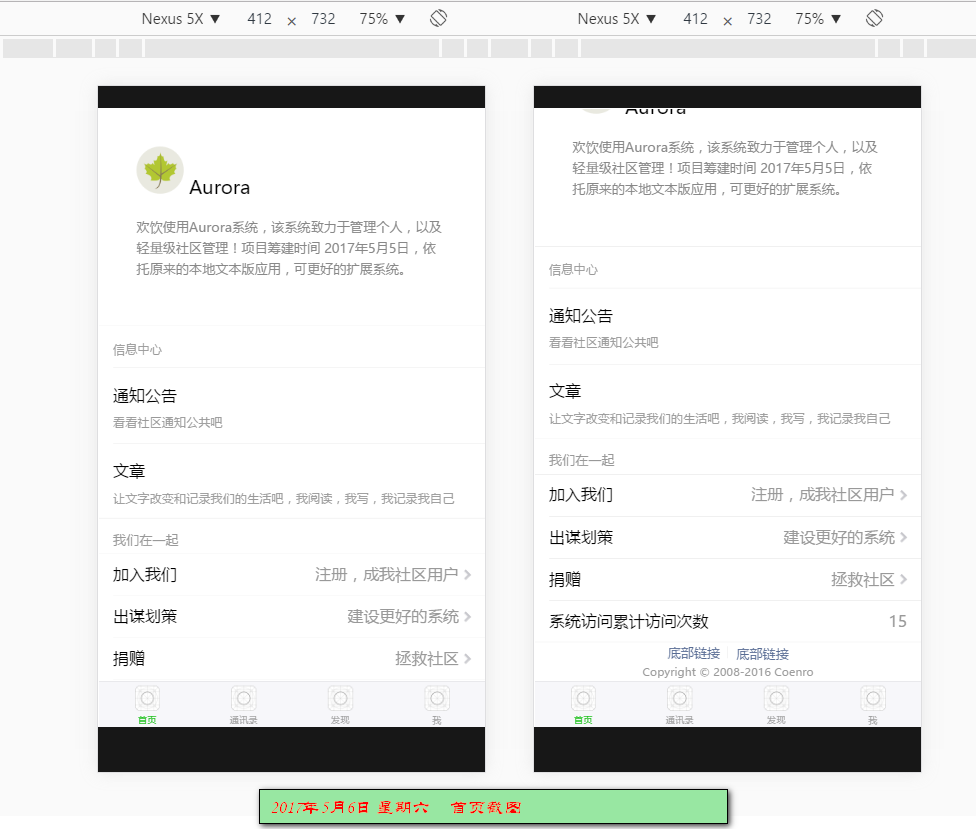

# 更改版本记录
## V 0.1.1  2017年5月14日 星期日
- 系统后台API保护机制处理，以及其他优化

## V 0.1.0  2017年5月14日 星期日
- 第一期预想的基本上设计了，因此第二版本号递增。第二期计划基本实现 web 后台管理程序的设计与实现
- 系统通过把session值作为文件名来扩展，用户访问计划实现如阅读时统计等，单次登录控制
- [移动版建设]
    - 系统优化设计，以及页面信息补全或其他微调整
- [桌面版建设]
    - 首页新增访问地址分布地图        
## V 0.0.11  2017年5月13日 星期六
- 系统首页模板更新： 用于后端想前端js渲染
- [移动版建设]
    - 系统反馈完善以及更新
        - 【系统反馈】显示后台数据
        - 【系统反馈】信息反馈阅读页面
    - 系统信息错误或成功提示公共页面
- [桌面版建设]
    - 首页 访问统计曲线图优化
    
## V 0.0.10  2017年5月12日 星期五
- 系统访问统计优化，信息 Aurora 全局处理类，与项目有关的业务逻辑
- 新增系统日志处理后台支持，进行数据库设计
- 信息系统计数器功能，以及进行后台数据设计
- [桌面版建设]
    - 新增首页访问统计曲线
    - 引入 [ecomfe/echarts v3.5.4](https://github.com/ecomfe/echarts)
    - 后台实现对应的数据支持，新增相关调用API： Feek/Index  后者为全局接口
    - 头部模板更新，将jquery.slim.min.js 替换对应版本的JQuery3.2.1，由于前者部分API无效
- [移动版建设]
    - 首页以及系统设置部分页脚优化处理
    - 系统反馈实现统计功能
    - 新增系统数据表单处理页面，设计基本布局
- 系统开发规范化： 前端页面的 url 采用后台提取，不在写死便于以后更变或维护

## V 0.0.9  2017年5月10日 星期三
- 系统架构设计： 支持令牌访问机制，通过令牌进行特权限授权
- 系统界面统一调整： 头部描述信息补全，页脚信息提交
- 引入php包含库： 
    - [erusev/parsedown-V1.6.2](https://github.com/erusev/parsedown)        makedown 文件解析
    - [t0k4rt/phpqrcode](https://github.com/t0k4rt/phpqrcode)        php 二维码处理库
    - 将以上两个引入库 接口化处理
- 系统错误页面处理新增，包括 web/wap端
- 新增接口： Visit, Token 访问和令牌处理模型以及相关的对应API接口
- 数据库更新等
- [桌面版建设]
    - 首页更新，搭建基本你的布局
    - 新增手机端与浏览器端访问对比
    - 信息 项目说明以及版本说明 - API地址链接
    - 错误模块展示页面
- [移动版建设]
    - 错误新增展示页面
    - 其他优化    
- 截图
    - 
    - 
    - 
    - 

## V 0.0.7  2017年5月9日 星期二
- 系统架构层面优化， 后台程序采用接口处理，方便 web/mobile/Android app 等同应用访问。
- 接口计划： 需要采用一种基本安全权限控制处理
- [移动版建设]
    - 引入微信处理库 [netputer/wechat-php-sdk](https://github.com/netputer/wechat-php-sdk) ， 可以选择其他可选sdk [wechat-php-sdk](https://github.com/dodgepudding/wechat-php-sdk)。 由于订阅号的限制，暂时使用前者
    - 原后台数据支持转移到 api 中，仅仅做 UI 层
    - 新增系统反馈页面： 用户建议，问题，留言等操作， 任何用户。 带数据表单
    - 计划项： 数据模块与后台数据映射
- [桌面版建设]
    - 尝试引入 bootstrap v4.0.0 alpha-6 做主界面程序
    - 头部模板更新等
- 其他： 本次更改较大，版本号迭代2小版本后
    

## V 0.0.4  2017年5月8日 星期一
- [移动版建设]
    - 用户注册和登录后台程序支持： 
        - 系统可进行注册以及登录相关认证
        - 新增用户日志
    - 首页 tabs 设计
        - 采用后端渲染以及前端动态结合的方法
    - 以及部分代码优化等处理
        - 首页界面自动恢复

## V 0.0.3  2017年5月7日 星期日
- [移动版建设]
    - 用户注册后台数据保存支持
    - 前端设计调整
    - Doeeking V2 部分代码引用
        
## V 0.0.2  2017年5月6日 星期六
- [移动版建设]
    - 新增 注册页面布局
    - 新增 登录页面布局
    - 其他界面设置等
    - 完善数据库设置，基础sql 脚本
## V 0.0.1  2017年5月6日 星期六
- 
- 系统架构
       系统自动匹配访问设备， 选择对应的Mobile与Web版应用
       多套设置与构思，如独立的Application目录。最终确定为单模块，并且通过默认访问模块实现

- [移动版建设]
       首页设计与实践
       前端库新增，Weui 安装以及基本配置
       网站图标等资源选定
       框架视图，以及目录优化处理

## V 0.0.0  2017年5月5日 星期五
- 项目准备与构思
- 代码仓库初始化
- 服务器等准备
- 项目设计规划
- 数据库设计